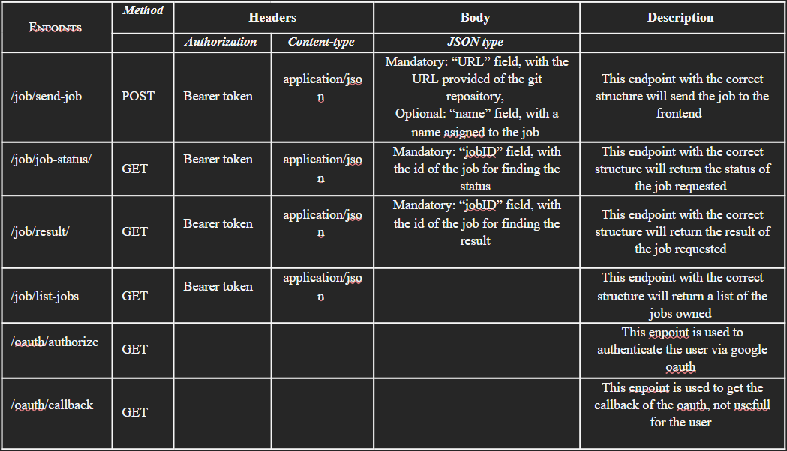

<h1 align="center">
  <br/>
      FaaS-GIT
  <br/>
</h1>

Function-as-a-Service(FaaS) is a revolutionary paradigm, redefining how 
applications are developed, deployed, and scaled. FaaS represents a serverless 
computing model where developers can focus solely on writing code without the 
burden of managing underlying infrastructure. This revolutionary approach 
enables efficient, scalable, and cost-effective solutions, unlocking new 
possibilities for application architecture. 

We designed a FaaS for git public projects as the central project of one 
Master's subject, SAD (*Servicios y Aplicaciones Distribuidas*). On the next 
lines we explain how to deploy the project and test it. In addition, we 
describe how this git public projects must be built to use it on the FaaS.

## Table of Contents

1. [Development Environment](#development-environment) - Prerequisites for 
deployment
2. [Quick Start](#quick-start) - Deployment guide
3. [Using the project](#using-the-project) - All project possibilities
4. [Function rules](#function-rules) - Functions to be run have to follow this steps
5. [Test](#test) - Simple test of the project
6. [Contributors](#contributors) - Members of the project group

## Development Environment

!Todo Environment to deploy (Docker)

## Quick Start

```shell
sudo docker-compose up
```

## Function rules

Frontend

<br>

To use this Faas, we first need to authenticate the user via oauth. To do that, we will use the endpoint /oauth/authorize, to enter in the google oauth section. After the google login, we will recieve the bearer token used to authenticate in every job Endpoint of the api.



In a curl example of sending a job to the frontend: 

```bash
curl --location 'http://localhost:3000/job/send-job' \ 
--header 'Content-Type: application/json' \ 
--header 'Authorization: Bearer {{YOUR JWT BEARER TOKEN HERE}' \ 
--data '{ 
    "URL":"https://github.com/mvievaz/PI-Test-for-FaaS.git", 
    "name": "Job1" 
}' 
```

<br>

Worker 

<br>

In our architecture, we support the execution of various programming languages within our worker services. However, for these services to operate effectively, the associated Git repository must include a document detailing the execution context. This document will be faas-manifest.json with the following fields: 

- “language”: Field mandatory with 3 options: “python”, “rust”, “nodeJS” 

- “arg”: Field optional to pass parameters to the main function, works on python and rust 

- “requirementsFile”: Field optional with the pip packages to download. Works on  python only 

- “mainFile”: Field mandatory when using python language to specify the python file to execute 

When the git repository is structured for Node.js, it must include a package.json file containing dependencies and a preconfigured npm start command to ensure proper functionality. 

## Test

!ToDo Test tutorial

## Contributors

- Óscar Roselló Ibáñez, [@orosiba](https://github.com/orosiba) - Project member
- Alexandre Moncho Rubio, [@Axen81](https://github.com/Axen81) - Project member
- Miquel Viel Vazquez, [@mvievaz](https://github.com/mvievaz) - Project member
